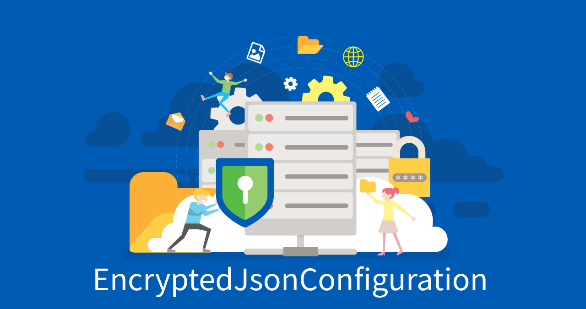

### Configuring your .NET Core with encrypted JSON files has never been so easy


Use encrypted JSON file with this configuration provider for .NET Core's `Microsoft.Extensions.Configuration`. The JSON files use AEAD AES-256-GCM encryption.

### Motivation

Projects often contains sensitive information like database connection strings, API keys or usernames and passwords for external services. This information should never be committed to source control and should be handled in a secure way. Key vaults like those provided by Azure and AWS aren't always available for projects that can't be connected to the internet.

## Installation

You can install the package via the NuGet Package Manager by searching for `Miqo.EncryptedJsonConfiguration`. You can also install the package via PowerShell using the following command:

```ps
Install-Package Miqo.EncryptedJsonConfiguration
```

or via the dotnet CLI:

```ps
dotnet add package Miqo.EncryptedJsonConfiguration
```

## Getting started

Add the following to your `Program.cs` file:

```csharp
using Miqo.EncryptedJsonConfiguration;
```

To decrypt a configuration file you will need a base64 formatted encryption key:

```csharp
var key = Convert.FromBase64String(Environment.GetEnvironmentVariable("SECRET_SAUCE"));
```

### Loading the encrypted JSON configuration

The encrypted JSON configuration can be loaded from a file in your `Program.cs` like this:

```csharp
Host.CreateDefaultBuilder(args)
    .ConfigureAppConfiguration((hostingContext, config) =>
    {
        config.AddEncryptedJsonFile("settings.ejson", key);
    })
    ...
```

`AddEncryptedJsonFile()` also supports the `optional` and `reloadOnChange` parameters.

You can also load the encrypted JSON configuration from a stream like this:

```csharp
Host.CreateDefaultBuilder(args)
    .ConfigureAppConfiguration((hostingContext, config) =>
    {
        config.AddEncryptedJsonStream(ejsonStream, key);
    })
    ...
```

You can now access your application's settings by injecting `IConfiguration` or `IOptions` in your classes.

### Accessing the configuration from your code

You can load your configuration into your own custom settings class. Create a class with the properties that matches your encrypted JSON file:

```csharp
public class AppSettings
{
    public string ConnectionString { get; set; }
    public string EmailApiKey { get; set; }
}
```

Add the following to `ConfigureServices` method in your  `Startup.cs` file:

```csharp
services.AddJsonEncryptedSettings<AppSettings>(_configuration);
```

Your configuration will be loaded into your AppSettings class object and can be injectedable singleton in your code.

```csharp
private readonly AppSettings _settings;

public YourController(AppSettings settings)
{
    _settings = settings;
}

public void GetRecordsFromDatabase()
{
    var connectionString = _settings.ConnectionString;
}
```

## Creating an encrypted configuration file

The easiest way to create encrypted configuration files and encryption keys is to use the [Kizuna](https://github.com/miqoas/Kizuna) command line tool. Please check the tool's GitHub page for more information.

You can still encrypt the configuration files from your own code if you prefer that.

### Using Kizuna

Before you begin you need to install the Kizuna command line tool. See the [Kizuna project page](https://github.com/miqoas/Kizuna).

Start by creating a new encryption key.

```bash
$ kizuna generate
```

Make sure you write down the encryption key in a safe location, like a password manager (1Password, LastPass, etc.). Never commit the encryption key into source code.

Create a JSON file in your favorite file editor. When you are ready to encrypt the JSON file, use the following command.

```bash
$ kizuna encrypt -k {key} {filename}
```

If you need to decrypt the file to make changes you can use the following command:

```bash
$ kizuna decrypt -k {key} {filename}
```

The file's contents is replaced with the encrypted or decrypted configuration when the `encrypt` or `decrypt` command is used. Add the `-c` option to output to your console instead of writing to the file system.

### Encrypting the configuration file yourself

If you prefer to create your JSON configuration files programatically then you'll find some helpful helper methods in the static `AesEncryptionHelpers` class.

Generate an encryption key:

```csharp
var key = AesEncryptionHelpers.GenerateBase64EncodedKey();
```

To serialize a settings class and encrypt it:

```csharp
var cipher = AesEncryptionHelpers.Encrypt<AppSettings>(settings, key);
```

The `AesEncryptionHelpers` static class also include methods these methods to help you generate encryption keys, encrypt or decrypt text:

* `byte[] GenerateKey()`
* `string GenerateBase64EncodedKey()`
* `string Encrypt(string text, string key)`
* `string Encrypt(byte[] text, byte[] key)`
* `string Encrypt<T>(T settings, string key)`
* `string Encrypt<T>(T settings, byte[] key)`
* `string Decrypt(string cipher, string key)`
* `string Decrypt(byte[] cipher, byte[] key)`

## Acknowledgements

Miqo.EncryptedJsonConfiguration uses some of the encryption code from the [CryptHash.NET](https://github.com/alecgn/crypthash-net/) (MIT license) library for it's AES-256-GCM operations.
